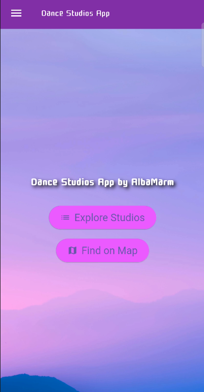
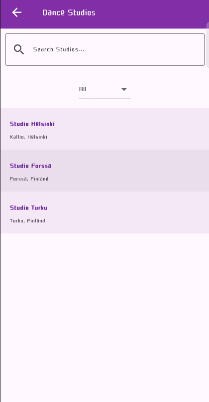
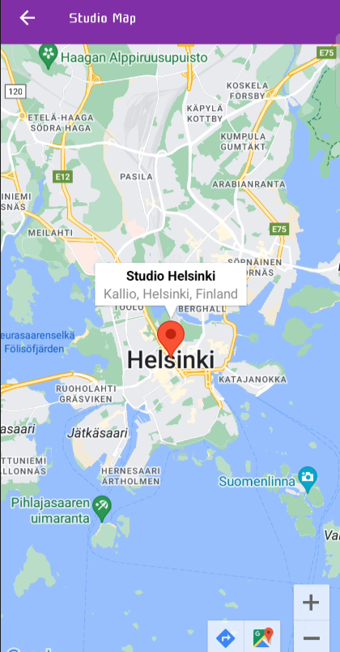

# Dance-Studios-App
A Flutter-based mobile application designed to explore dance studios in Finland. This app provides essential tools to locate studios on a map and learn more about them.

## ✧ Screenshots ✧

  
  
  

## ✧ Features ✧
- **Studio List**: Browse a curated list of studios with detailed information.
- **Interactive Map**: View dance studios located in Helsinki, Forssa, and Turku.
- **Modern UI**: An appealing interface with a purple and white theme.
- **Search and Filter**: Find studios by name or dance styles.
- **Navigation Drawer**: Switch between pages easily with the side menu.

### ✧ Development ✧
- **Technologies**:
  - Flutter
  - Google Maps API

### ✧ Contact ✧
- **Email**: [alba03943@gmail.com](mailto:alba03943@gmail.com)
- **LinkedIn**: [Alba Marmolejo Ramos](https://www.linkedin.com/in/alba-marmolejo-ramos-34b833331/)

### ✧ Author: AlbaMarm, 2024 ✧
